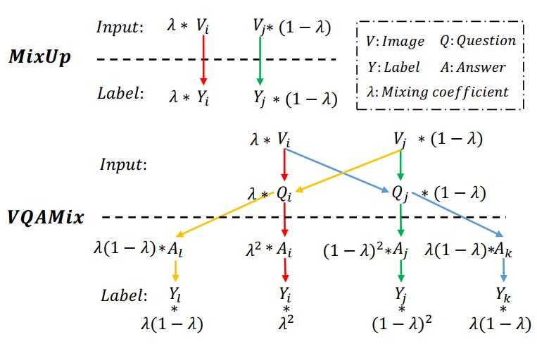
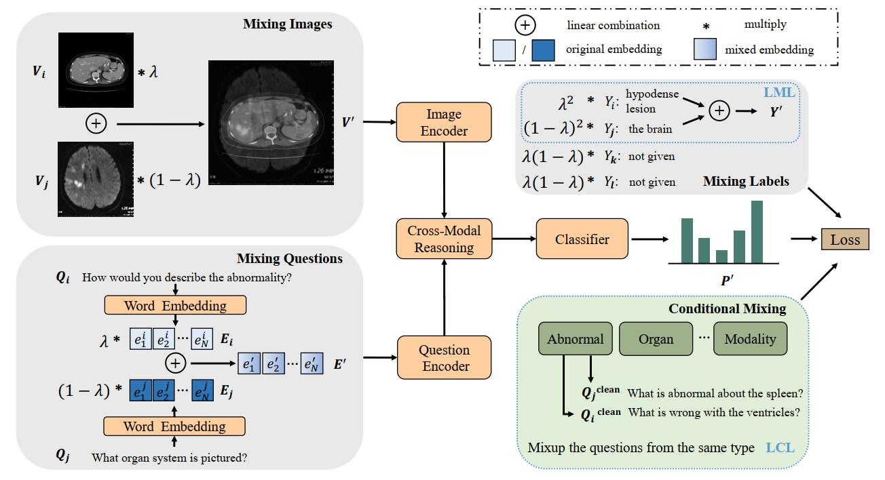
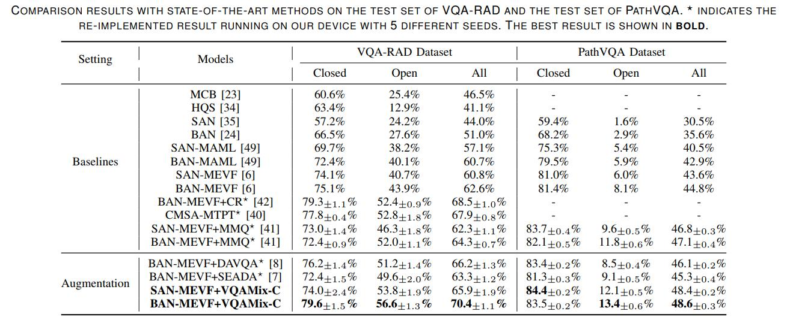

# VQAMix: Conditional Triplet Mixup for Medical Visual Question Answering [paper](https://www.researchgate.net/publication/361364110_VQAMix_Conditional_Triplet_Mixup_for_Medical_Visual_Question_Answering) 
### IEEE Transaction on Medical Imaging 

This repository is the official implementation of `VQAMix` for the visual question answering task in medical domain. In this paper, we propose a simple yet effective data augmentation method, VQAMix, to mitigate the data limitation problem. Specifically, VQAMix generates more labeled training samples by linearly combining a pair of VQA samples, which can be easily embedded into any visual-language model to boost performance.

This repository is based on and inspired by @Jin-Hwa Kim's [work](https://github.com/jnhwkim/ban-vqa) and @Aizo-ai's [work](https://github.com/aioz-ai/MICCAI19-MedVQA). We sincerely thank for their sharing of the codes.


### Citation

Please cite this paper in your publications if it helps your research

```
@article{gong2022vqamix,
  title={VQAMix: Conditional Triplet Mixup for Medical Visual Question Answering},
  author={Haifan Gong and Guanqi Chen and Mingzhi Mao and Zhen Li and Guanbin Li},
  journal={IEEE Trans. on Medical Imaging},
  year={2022}
}
```


In VQAMix, two image-question pairs {Vi, Qi} and {Vj, Qj} are mixed. When the mixed sample is  sent to the VQA model, the linguistic feature extracted from Qi will interact with the visual feature extracted from Vj, which constructs a new connection {Vj, Qi}. So is {Vi, Qj}. Thus, the label for the mixed image-question pair consists of four answer labels (Yi for {Vi, Qi}, Yj for {Vj, Qj}, Yk for {Vi, Qj} and Yl for {Vj, Qi}). And the weights of those answer labels are the probabilities of occurrence of those imagequestion pairs. The answer A is encoded as a one-hot vector Y.


An overview of our proposed VQAMix enhanced by Learning with Missing Labels (LML) and Learning with Conditional-mixed Labels (LCL) strategies. Two VQA samples are combined linearly in the training phase. To ensure that the mixed label can be used to supervise the learning of VQA models, both LML and LCL scheme discards those two unspecified labels to solve the missing labels issue. Moreover, to avoid meaningless answers, the LCL scheme further utilizes the category of the question to avoid the model suffering from meaningless mixed labels.

### Prerequisites
torch                       1.6.0+
torchvision                 0.6+

### Dataset and Pre-trained Models

The processed data should be downloaded via [Baidu Drive](https://pan.baidu.com/s/1U4ohCzTkSVv4My5mcxUrJg) with the extract code: `i800`. 
Or you can download the data from the previous work `MMQ`[link](https://github.com/aioz-ai/MICCAI21_MMQ). The downloaded file should be extracted to `data_RAD/` and `data_PATH` directory.

The trained models are available at [Baidu Drive](https://pan.baidu.com/s/1zfgNMOcthRW1guG37YPw_g) with extract code: `6su8`.

### Training and Testing
Just run the `run_rad.sh` `run_path.sh` for training and evaluation.
The result json file can be found in the directory `results/`.

### Comaprison with the sota



### License
MIT License

### More information
If you have any problem, no hesitate contact us at haifangong@outlook.com
